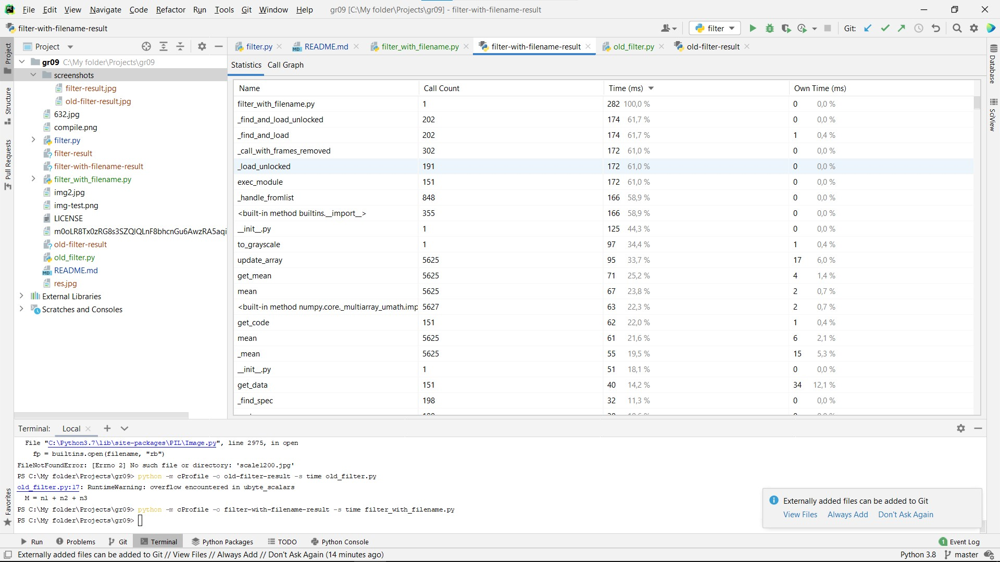
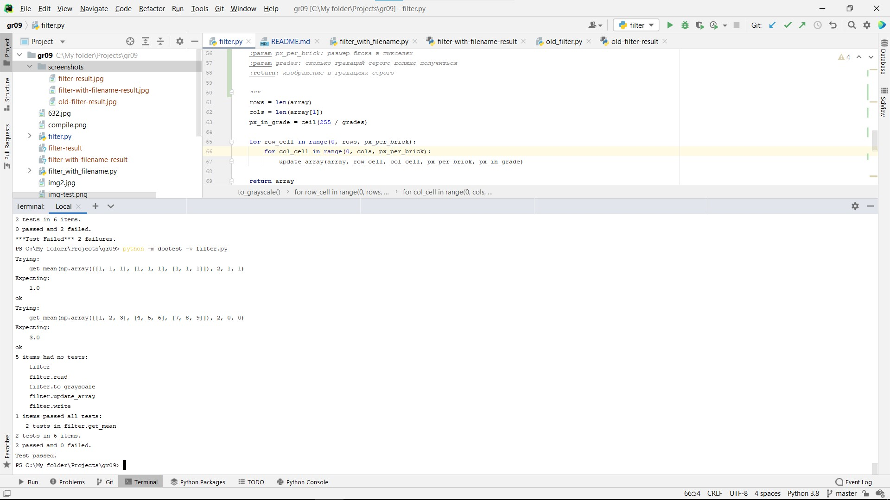

``filter.py``

``old_filter.py``

old-filter выполняется быстрее, так как не запрашивает
консольный ввод

---

``filter_with_filename.py``

filter_with_filename.py показывает самое быстрое время
выполнения, так как мы не использовали консольный ввод и 
для преобразования изображения использовали библиотеку Numpy

---

Изображение ``img2.jpg`` до преобразования:

и после:

---

doc-тесты

---

